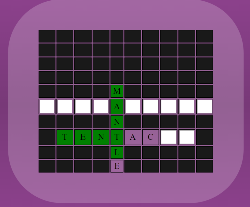

# CSC256 7.1

## Guidelines and Expectations
1. Create a simple 3-word crossword puzzle.
2. Create clues for each of the 3 words.
3. Use at least one array and one loop.
4. Use JavaScript to display text on the HTML page.
5. Be creative and make a great user experience!
## Screenshots

